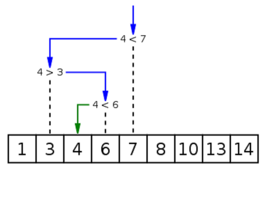

# Markdown
## 1.二分搜索算法
在计算机科学中，二分搜索（英语：**binary search**），也称折半搜索（英语：**half-interval search**）、对数搜索（英语：**logarithmic search**），是一种在<u>有序数组中查找某一特定元素的搜索算法</u>。搜索过程从数组的中间元素开始，如果中间元素正好是要查找的元素，则搜索过程结束；如果某一特定元素大于或者小于中间元素，则在数组大于或小于中间元素的那一半中查找，而且跟开始一样从中间元素开始比较。如果在某一步骤数组为空，则代表找不到。这种搜索算法每一次比较都使搜索范围*缩小一半*。
***

***
代码
```C
int binary_search(const int arr[], int start, int end, int khey) {
if (start > end)
return -1;
  
int mid = start + (end - start) / 2;    //直接平均可能会溢位，所以用此算法
if (arr[mid] > khey)
return binary_search(arr, start, mid - 1, khey);
else if (arr[mid] < khey)
return binary_search(arr, mid + 1, end, khey);
else
    return mid;        //最後检测相等是因为多数搜寻状况不是大於要不就小於
}
```
***
[二分搜索算法](https://baike.baidu.com/item/%E4%BA%8C%E5%88%86%E6%90%9C%E7%B4%A2%E7%AE%97%E6%B3%95/4081752)
***