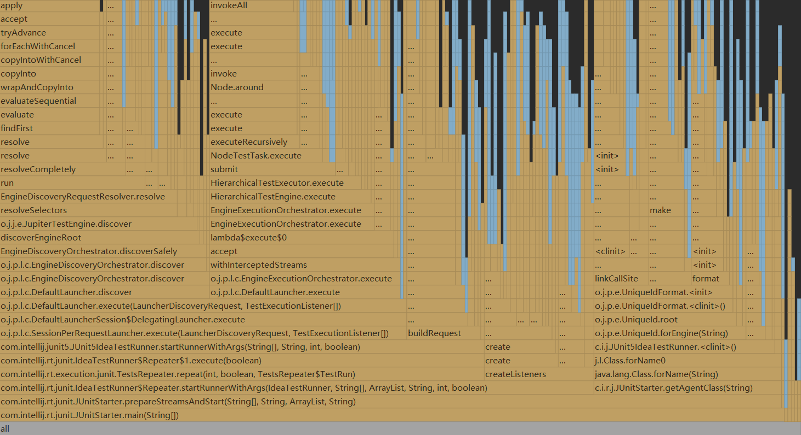

#插入排序中什么操作最耗时
***
##过程
在项目中添加Sort.java文件代码如下：
```java
import java.util.Random;

public class Sort {
    private static boolean isSorted(int[] a) {
        for (int i = 1; i < a.length; i++) {
            if (a[i] < a[i-1]) return false;
        }
        return true;
    }

    public static void sort(int[] a) {
        int n = a.length;
        for (int i = 1; i < n; i++) {
            for (int j = i; j > 0 && a[j] < a[j-1]; j--) {
                int tmp = a[j];
                a[j] = a[j-1];
                a[j-1] = tmp;
            }
        }
    }

    public static void main(String[] args) {
        int[] a = new int[100000];
        for (int i = 0; i < 100000; i++) {
            a[i] = new Random().nextInt(10000);
        }
        assert !isSorted(a);
        sort(a);
        assert isSorted(a);
    }
}
```
***
运行结果如下：

***
结果不明显，换用test框架进行进一步分析
***
在项目中，对sort函数使用test测试框架生成SortTest.java文件
```java
import static org.junit.jupiter.api.Assertions.*;

class SortTest {

    @org.junit.jupiter.api.Test
    void sort() {
    }
}
```
运行结果如下：

